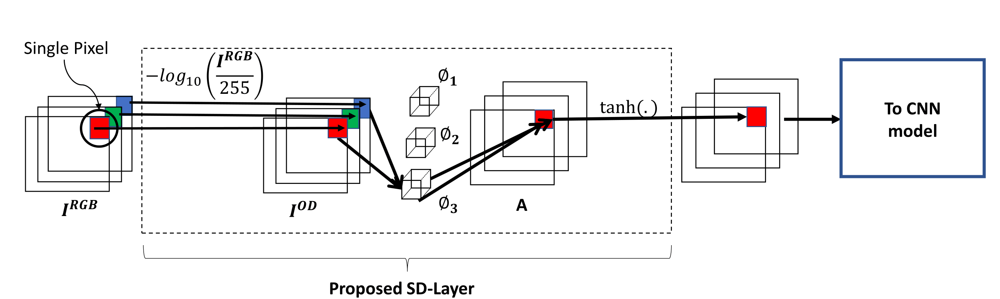

## SD-Layer

This repository contains the code accompanying our MICCAI 2017 paper "SD-Layer: Stain Deconvolutional Layer for CNNs in Medical Microscopic Imaging". The following figure (borrowed from our paper) illustrates the architecture of SD-Layer. 

Fig 1. An illustration of SD-Layer.

For more details, please refer to our [paper](https://link.springer.com/chapter/10.1007/978-3-319-66179-7_50) or [poster](http://www.rahulduggal.com/files/MICCAI_Poster.pdf). 

### Citing this code

If you find this code useful in your research, please consider citing:

    Duggal R., Gupta A., Gupta R., Mallick P. (2017) SD-Layer: Stain Deconvolutional Layer for CNNs in Medical Microscopic Imaging. In: Descoteaux M., Maier-Hein L., Franz A., Jannin P., Collins D., Duchesne S. (eds) Medical Image Computing and Computer-Assisted Intervention − MICCAI 2017. MICCAI 2017. Lecture Notes in Computer Science, vol 10435. Springer, Cham

### Contents
1. [Requirements](#requirements)
2. [Training](#training)
3. [References](#references)
4. [Contact](#contact)
5. [License](#license)

## Requirements
To run this code, you will require the following softwares.
1. [Anaconda](https://www.anaconda.com/download/#linux) (for python ver 2.7 ) - A package of useful python libraries
2. [Keras](https://pypi.python.org/pypi/Keras/1.2.1) (ver 1.2.1) - A high level neural network library written in python. 
3. [Theano](http://deeplearning.net/software/theano/install.html) (ver 0.9.0) - A python library to efficiently evaluate mathematical expressions on GPU. 

## Training

* To train AlexNet or Texture-CNN models [1] prefitted with SD-Layer, follow the code within `Code/Train/training.ipynb`.
* The implementation of SD-Layer resides in `Code/Train/SDLayer.py`.
* The implementation of SVD based color deconvolution resides in `Code/Train/macenko.py`. Please refer to [2] for the method details.
* The implementation of Energy layer resides in `Code/Train/energyPool.py`. Please refer to [1] for details.

## References
[1] Andrearczyk, Vincent, and Paul F. Whelan. "Using filter banks in convolutional neural networks for texture classification." Pattern Recognition Letters 84 (2016): 63-69.

[2] Macenko, Marc, et al. "A method for normalizing histology slides for quantitative analysis." Biomedical Imaging: From Nano to Macro, 2009. ISBI'09. IEEE International Symposium on. IEEE, 2009.

## Contact

For any assistance with the code or for reporting errors, please get in touch at rahulduggal2608 [at] gmail [dot] com.

## License
This code is released under the MIT License (refer to the LICENSE file for details).

